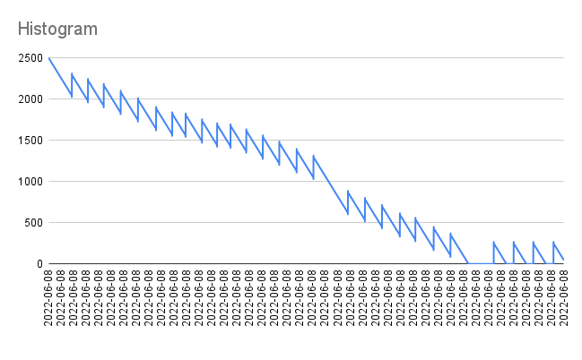
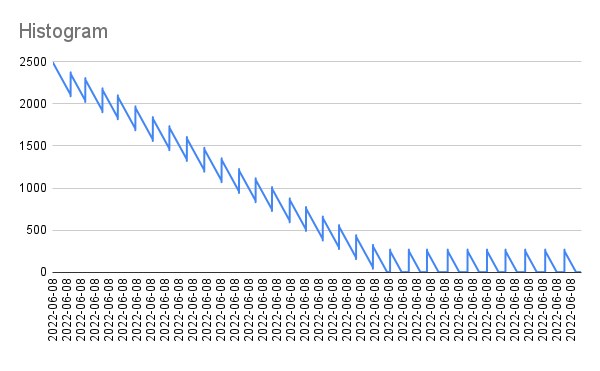
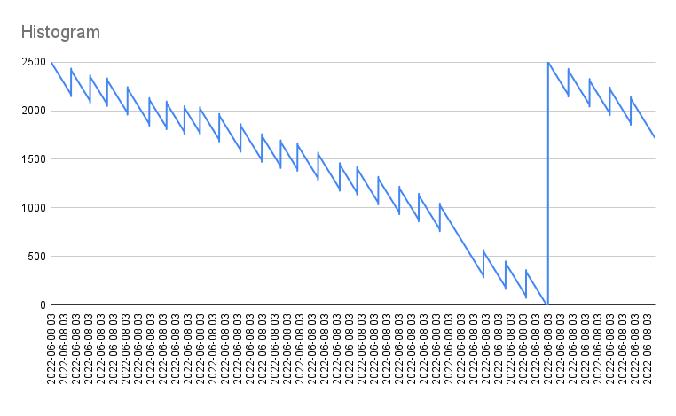

### API Rate Limiting

Inspired by Stripe blog: https://stripe.com/blog/rate-limiters

#### Token Bucket Algorithm Implementation

A Python Flask App + Redis Cache implementation of the algorithm.

### Graphs

BUCKET SIZE 2500, REFILL SIZE 250, INTERVAL 1 SEC



Without Concurrency Check for Redis

**WRK Stats**
```
11447 requests in 30.10s, 1.93MB read
Non-2xx or 3xx responses: 1696
```



With Concurrency Check using Redis Pipeline transactions that smoothens the curve


**WRK Stats**
```
10312 requests in 30.02s, 1.85MB read
Non-2xx or 3xx responses: 223
```




With Concurrency Check for Redis Pipeline, bump to bucket size on hitting empty bucket

**WRK Stats**
```
10039 requests in 30.04s, 1.81MB read
Non-2xx or 3xx responses: 24
```

